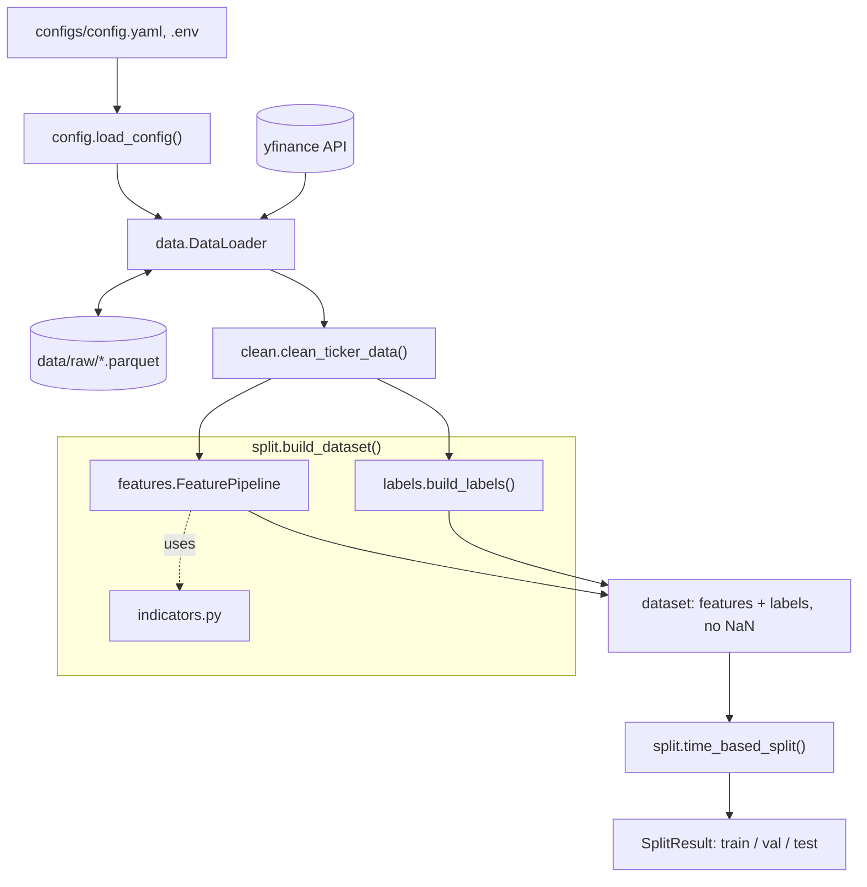

# Architecture

How `idxlab` turns raw Yahoo Finance prices into model-ready train/validation/test sets. This document covers what exists after Week 2; modeling, backtesting, and serving are listed at the bottom as planned work.

## Pipeline overview

## Modules

| Module | Responsibility | Main API | Depends on |
|---|---|---|---|
| `config.py` | Load YAML settings, allow env-var override of log level | `Config`, `load_config` | none |
| `logging_setup.py` | Configure logging once, at the program entry point | `setup_logging` | none |
| `data.py` | Fetch OHLCV from yfinance, flatten its columns, cache each ticker as parquet | `DataLoader` | `config` |
| `clean.py` | Remove duplicate dates, fill small gaps, flag suspect price jumps, align tickers to a common calendar | `clean_ticker_data`, `align_trading_calendar` | none |
| `indicators.py` | Technical indicators as pure functions on pandas Series | `sma`, `ema`, `rsi`, `macd`, `bollinger_bands`, `atr`, `obv`, `momentum` | none |
| `features.py` | Combine all indicators into one feature table | `FeaturePipeline` | `indicators` |
| `labels.py` | Build prediction targets from future prices | `forward_return`, `direction_label`, `build_labels` | none |
| `split.py` | Join features and labels, then split chronologically | `build_dataset`, `time_based_split`, `SplitResult` | `features`, `labels` |

## Data contract between stages

| Stage | Shape | Known NaN behavior |
|---|---|---|
| Raw (`DataLoader.load`) | `DatetimeIndex` named `date`; columns `Open, High, Low, Close, Volume` | May contain gaps and duplicate dates |
| Cleaned (`clean_ticker_data`) | Same columns plus boolean `split_suspect` | No NaN, no duplicate dates |
| Features (`FeaturePipeline.transform`) | 12 columns: `sma, ema, rsi, macd, macd_signal, macd_histogram, bb_upper, bb_lower, bb_width, atr, obv, momentum` | Leading rows NaN (indicator warm-up) |
| Labels (`build_labels`) | `forward_return` (%), `direction` (1.0 up, 0.0 down or flat) | Trailing `horizon` rows NaN (no future price yet) |
| Dataset (`build_dataset`) | 12 feature columns + 2 label columns | No NaN |
| Split (`time_based_split`) | `SplitResult` with `train`, `val`, `test` | Chronological, no overlap (validated on creation) |

## Design decisions

1. **Time only flows forward.** Splits are never shuffled. A feature for date `t` uses data up to `t` only (enforced by `test_features_do_not_use_future_data`), while a label deliberately uses the price `horizon` days later. `SplitResult` raises an error if train, validation, and test ever overlap.
2. **NaN is kept where it arises and dropped in one place.** Indicator and label functions leave warm-up NaN (start of the series) and horizon NaN (end of the series) in place. Only `build_dataset` drops them, so the decision lives in a single function.
3. **Pure functions, thin classes.** Cleaning, indicator, and label logic are plain functions of pandas objects, which keeps them easy to test. Classes (`DataLoader`, `FeaturePipeline`, `Config`, `SplitResult`) only hold configuration or state.
4. **Configuration and logging live at the edges.** Entry points (notebooks, scripts, later the API) call `load_config` and `setup_logging` once. Library modules receive explicit parameters and only create their own logger.
5. **Cache raw data, not derived data.** Each ticker is cached as one parquet file under `data/raw/`. Cleaning and features are cheap to recompute, so they are not cached. Use `force_refresh=True` to bypass the cache.
6. **Targets never enter the inputs.** When training, `X` is the 12 feature columns and `y` is `direction` (or `forward_return`). Both label columns must be excluded from `X`, otherwise the model sees the answer.

## Quality gates

- `pytest` covers every module, including look-ahead leakage tests for features and labels.
- `mypy` runs with `disallow_untyped_defs`, so every function in `src/` needs type hints.

## Planned (not implemented yet)

Classical ML models and evaluation (Weeks 3-4), backtesting (Week 4), sequence models (Weeks 5-6), FastAPI service, Streamlit dashboard, Docker, and CI (Weeks 7-8). See `LEARNING_MAP.md` for the day-by-day plan.
