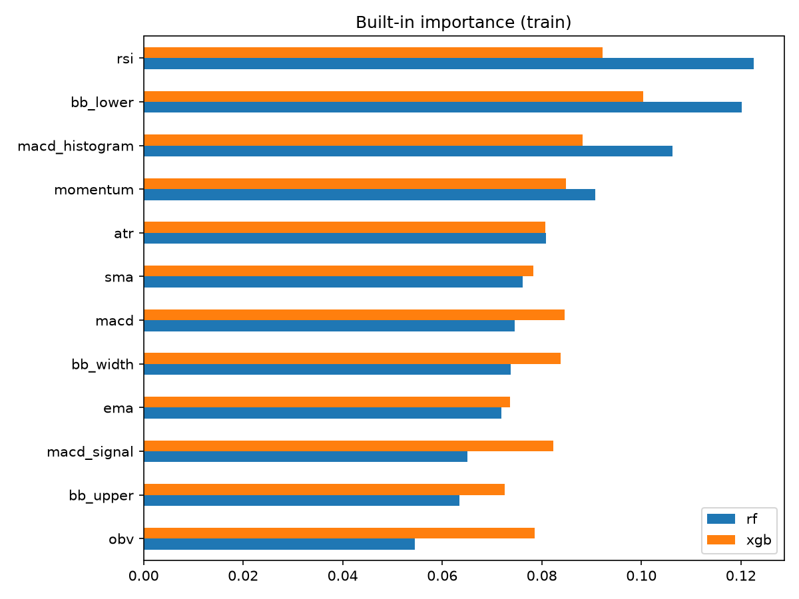
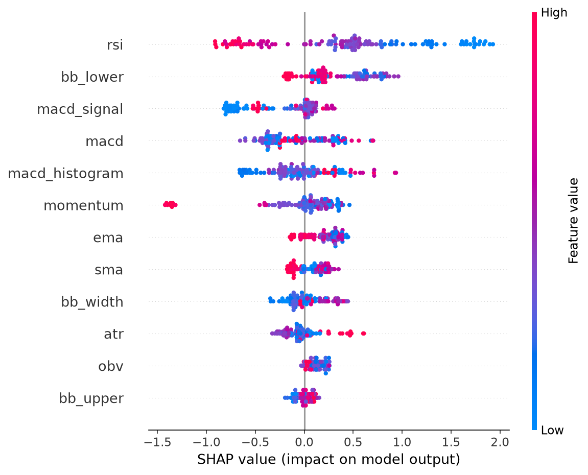

# Feature Importance (BBCA.JK)

## Purpose

Which of the 12 engineered features do the Random Forest and XGBoost models actually use, and does that use hold up on data the models have not seen?

## Setup

- Data: BBCA.JK, 12 technical features, label = next-day direction (horizon 1)
- Split: chronological 70 / 15 / 15; the test set is untouched
- Models: Random Forest and XGBoost, same hyperparameters as the model comparison (`notebooks/03_tree_models.ipynb`)

## Methods

| Method | What it measures | Computed on | Main caveat |
|---|---|---|---|
| Built-in importance | How much splits on a feature reduced the training error | Train | Reflects what the model fit, including noise |
| Permutation importance | Drop in validation ROC-AUC when one column is shuffled | Validation | Near zero when the model has no out-of-sample skill |
| SHAP (XGBoost) | Each feature's contribution to each individual prediction (mean absolute value) | Validation | Explains the model, not the market |
| Random-noise probe | Importance given to a column of random numbers | Train | Features at or below this level are indistinguishable from noise |

## Results

Full table: [`results/day15_importance.csv`](results/day15_importance.csv)

## Findings

1. Top features and whether the methods agree:
	                rf_builtin	xgb_builtin	rf_permutation_val	xgb_permutation_val	xgb_shap_val
rf_builtin	        1.00	    0.80	    0.33	            0.24	            0.64
xgb_builtin	        0.80	    1.00	    0.34	            0.35	            0.78
rf_permutation_val	0.33	    0.34	    1.00	            0.31	            0.13
xgb_permutation_val	0.24	    0.35	    0.31	            1.00	            0.26
xgb_shap_val	    0.64	    0.78	    0.13	            0.26	            1.00
2. Features ranked below the random-noise probe:
bb_lower          0.115
rsi               0.110
macd_histogram    0.104
bb_width          0.084
momentum          0.082
macd              0.072
atr               0.067
macd_signal       0.065
obv               0.063
ema               0.062
sma               0.060
bb_upper          0.059
random_noise      0.059
3. Groups of highly correlated features:
   sma       ema            0.997
   ema       bb_upper       0.977
   sma       bb_upper       0.977
             bb_lower       0.975
   ema       bb_lower       0.968
   macd      macd_signal    0.949
   bb_upper  bb_lower       0.904

## Caveats

- One ticker and roughly 130 validation rows: rankings are unstable
- Importance shows what a model uses, not what predicts the market
- Level-based features (price averages, OBV) can act as proxies for time

## Next steps

TODO: e.g. replace price-level features with ratios and re-run the comparison